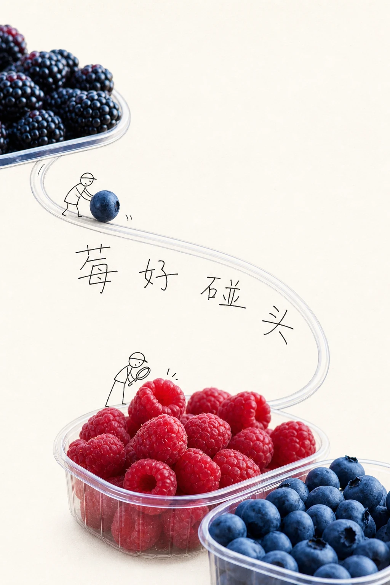
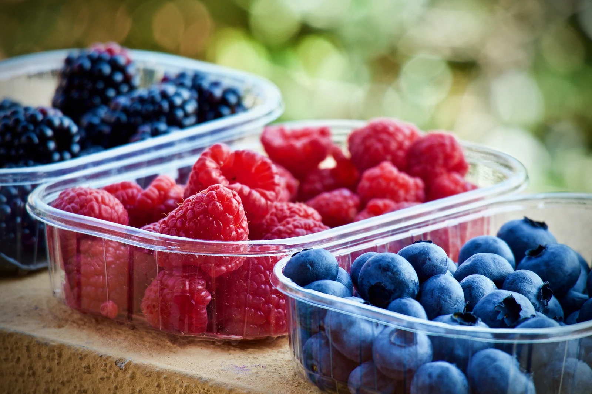
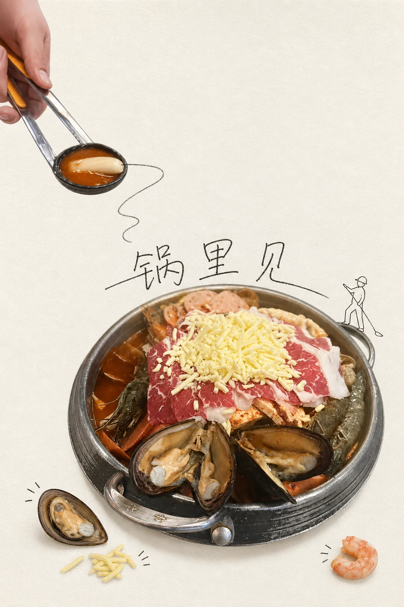
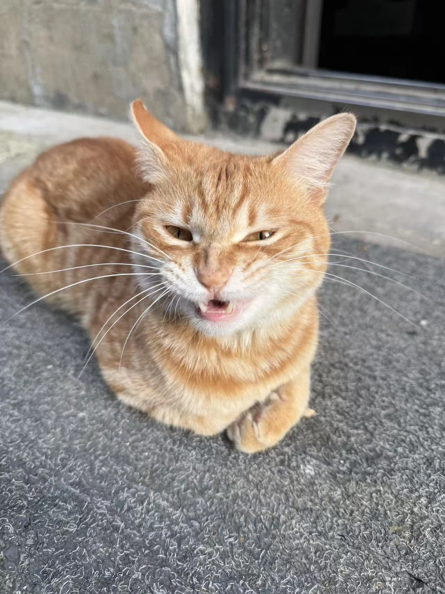
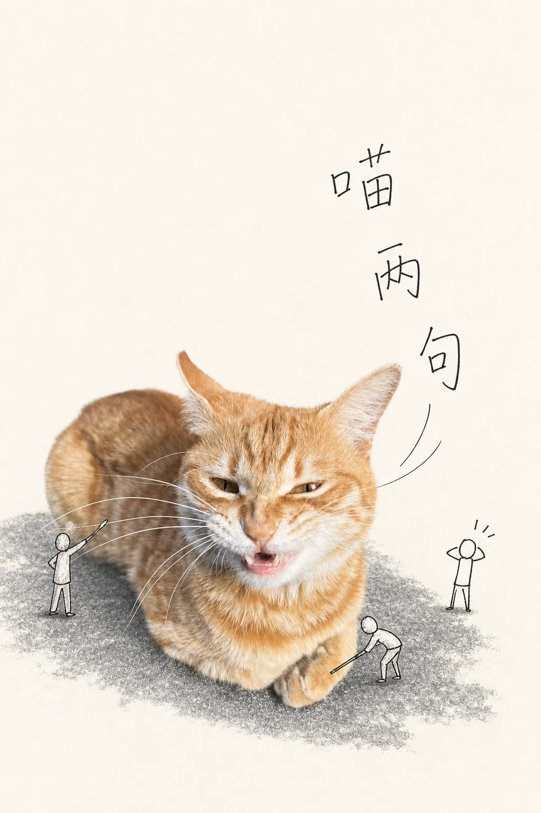

# Heytea Style Skill

> **Let real objects grow a sentence.**



<table>
  <tr>
    <td><a href="README.md">🇨🇳 中文介绍</a></td>
    <td><strong>🇬🇧 English introduction</strong></td>
    <td><a href="https://iamxk116-ai.github.io/heytea-style-skill/">Live gallery</a></td>
    <td><a href="https://github.com/iamxk116-ai/heytea-style-skill/releases/tag/v1.0.0">Download v1.0.0</a></td>
  </tr>
</table>

An image-to-poster Skill for Codex. It keeps the photographic texture of the source, then adds naive black-line drawing, loose short copy, and functional little figures to turn an ordinary photo into two spacious visual narratives.

<p>
  
  
  
</p>

## Before and after

All three examples below were generated by the repository author with this Skill. The source photograph is on the left and the text-integrated result is on the right.

| Source · Mixed berries | Result · “莓好碰头” |
| --- | --- |
|  |  |

| Source · Seafood and beef hotpot | Result · “锅里见” |
| --- | --- |
|  |  |

| Source · Orange cat | Result · “喵两句” |
| --- | --- |
|  |  |

## What it does

| Input | Process | Default output |
| --- | --- | --- |
| One real photograph | Read the anchor, material, action, and visible supporting elements | 1 text-integrated poster |
| One creative brief | Derive a short phrase from the subject's traits | 1 text-free narrative poster |
| Optional references | Learn structural relationships without copying brand assets | Prompt and correction notes |

### Two stories, not add-text / remove-text

- **Text-integrated**: the phrase acts as a path, label, dialogue, bridge, or object-attached note inside the composition.
- **Text-free narrative**: no words, letters, numbers, or random glyphs; real objects and figure actions carry the story.

Each version independently plans crop, negative space, object relationships, and action lines. The source stays recognizable and does not become a full cartoon.

## The method

**Read the object. Write the line. Let the line enter the composition.**

1. **Element map**: choose one photographic anchor and up to three visibly supported elements.
2. **Concept and verb**: decide what the objects are doing before writing the copy.
3. **Naive lettering**: thin black ink, slight tremor, crooked independent strokes, loose spacing; no standard fonts, calligraphy, or neat grid typography.
4. **Functional figures**: figures only push, pull, climb, look, measure, or otherwise change the object's narrative role.
5. **Targeted correction**: regenerate the lettering layer for text errors; restore photographic texture first when the subject drifts.

## Test gallery

The live gallery contains **9 cases / 27 WebP images / 18 complete Prompts**, with filters, a lightbox, expandable Prompts, and copy buttons:

**[Open the live gallery →](https://iamxk116-ai.github.io/heytea-style-skill/)**

Featured cases: seafood and beef hotpot, twilight architecture, mixed berries, a wooden café, puzzle and paper crane, washed blueberries, watermelon, tulips, and an orange cat.

## Install and use

### Install with Codex Skill Installer

```text
Use $skill-installer to install this Skill:
https://github.com/iamxk116-ai/heytea-style-skill/tree/main/heytea-style-skill
```

### Manual installation

Download [heytea-style-skill.skill](https://github.com/iamxk116-ai/heytea-style-skill/releases/download/v1.0.0/heytea-style-skill.skill), extract it, and place the top-level folder at:

```text
~/.codex/skills/heytea-style-skill
```

Then invoke it with:

```text
$heytea-style-skill Turn this photo into one text-integrated poster and one text-free narrative poster.
```

The Skill does not lock users to a particular image model. Each installer uses the image-generation tools, model access, and quota available in their own Codex environment.

## Repository layout

```text
heytea-style-skill/
├── heytea-style-skill/     # Installable Skill
├── docs/                   # GitHub Pages and public cases
├── dist/                   # .skill package
├── LICENSE                # MIT for Skill, docs, and scripts
└── NOTICE.md              # Image rights and unofficial-use notice
```

## Boundaries and licensing

This is an **unofficial style research project**. It is not affiliated with, authorized, sponsored, or endorsed by HEYTEA. Do not reproduce official logos, mascots, packaging marks, source copy, specific advertising layouts, or other protected brand assets.

- Skill instructions, documentation, and scripts: MIT License.
- Original and generated images under `docs/assets/cases/`: all rights reserved and excluded from the MIT license.
- Users are responsible for having the rights required to upload, edit, and publish their source photos.

## Local validation

```bash
python3 /path/to/skill-creator/scripts/quick_validate.py heytea-style-skill
python3 -m json.tool heytea-style-skill/evals/evals.json >/dev/null
python3 -m py_compile heytea-style-skill/scripts/composite_title_layer.py
unzip -t dist/heytea-style-skill.skill
```
